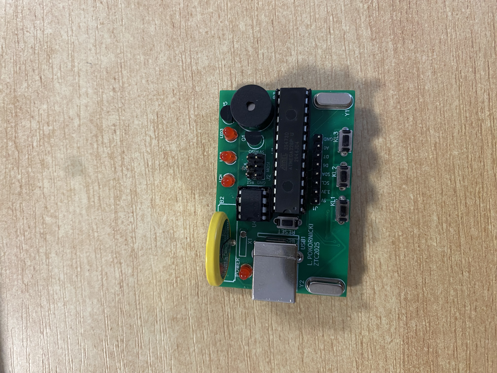
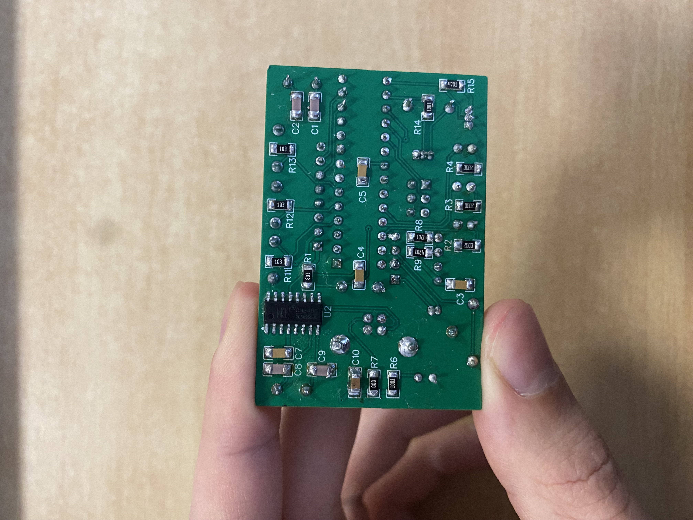

# Projekt budzika cyfrowego 
W ramach zajęć "Projektowanie systemów cyfrowych" zaprojektowałem budzik cyfrowy. Celem było wykonanie schematu elektrycznego, schematu PCB, przylutowanie elementów i stworzenie oprogramowania wszystkich założonych funkcji budzika.

## Funkcje budzika
- ustawianie i wyświetlanie aktualnej godziny
- ustawianie godziny budzika i włączanie/wyłączanie budzika
- wyświetlanie temperatury otoczenia z dokładnością do 1°C
- podtrzymanie aktualnej godziny oraz budzików po odłączeniu zasilania
- dźwięk buzzera w chwili uruchomienia budzika

## Moduły i czujniki
- Mikrokontroler ATMega328P
- Układ czasu rzeczywistego DS1307+
- Czujnik temperatury DS18B20
- Konwerter USB-UART CH340G
- Wyświetlacz 7 segmentowy TM1637

## Załączniki
[Schemat elektryczny](Schematic.pdf)
[Górna warstwa PCB](PCB_TopLayer.pdf)
[Dolna warstwa PCB](PCB_BottomLayer.pdf)

## Efekt końcowy
- 
- 
